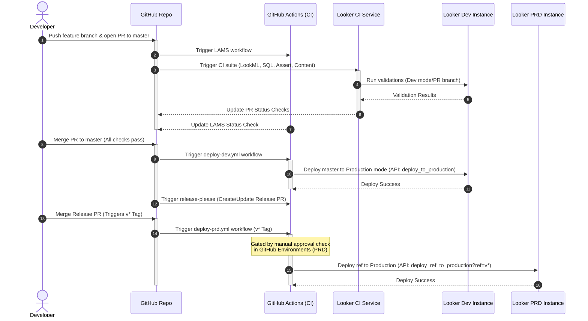

# Looker CI/CD Sample Project

This repository contains the LookML project for **looker_cicd_sample** along with a complete automated CI/CD pipeline integrated with **GitHub Actions**, **LAMS (LookAtMeSideways) Linter**, **Looker Continuous Integration (Looker CI)**, and **Release-Please**.

---

## CI/CD Workflow Overview

The entire CI/CD lifecycle is shown below:



### Detailed Pipeline Stages
1. **Pull Request Validation**: Pushing code to a feature branch and opening a PR triggers:
   - **LAMS**: GitHub Actions run the LookML linter to enforce code style.
   - **Looker CI**: Validates LookML syntax, tests database SQL for every modified explore/dimension/join, executes data tests (`test: ...`), and scans user content (dashboards, looks) in shared spaces to ensure nothing is broken.
2. **Post-Merge Development Deployment**: When a PR is merged into `master`:
   - An automatic deploy workflow (`deploy-dev.yml`) runs to authenticate against the Looker Dev instance and deploys the `master` branch to Production mode.
   - Simultaneously, **Release-Please** creates or updates a Release PR targeting `master` containing versioning updates and a changelog generated from Conventional Commits.
3. **Production Deployment & Content Migration**: When the Release PR is merged:
   - A release tag (matching `v*`) is pushed.
   - The production deployment workflow (`deploy-prd.yml`) is triggered.
   - This workflow is gated by a **manual approval check** configured under the GitHub Environment named `PRD`.
   - Once approved, the workflow:
     - Deploys the tagged LookML ref to the Looker Production instance using Looker's Advanced Deploy Mode API (`deploy_ref_to_production`).
     - Backs up and migrates Looker Shared Folder content (`looker-deployer` / `gazer`) from Dev to Production via Google Cloud Storage (GCS).

---

## Local Development Instructions

Developers should use the Looker IDE to build and test their LookML models in personal Development Mode.

### Pre-commit Guidelines
Before committing or pushing any LookML changes:
1. **LookML Validator**: Run the Looker LookML Validator in the IDE to ensure no compilation/syntax errors.
2. **Data Tests**: Execute all Looker data tests (configured via `test: ...` blocks) directly in the Looker IDE to verify data constraints and metrics correctness.
3. **Conventional Commits**: Commit messages must follow the [Conventional Commits](https://www.conventionalcommits.org/en/v1.0.0/) specification.
   - Use `feat:` for new features (e.g., `feat: add new user conversion explore`).
   - Use `fix:` for bug fixes (e.g., `fix: correct join path in order_items`).
   - Use `chore:`, `docs:`, `refactor:`, `style:`, `test:`, or `ci:` for non-functional tasks.
   - *Why?* Release-Please relies on these prefixes to automatically increment the version (patch, minor, major) and build the release changelog.

---

## Looker Continuous Integration (Looker CI) Integration

We use Looker's native **Continuous Integration (Looker CI)** feature for automated PR validation.

### 1. Enabling Looker CI on the Dev Instance
As a Looker Admin:
1. Navigate to the **Admin** panel on your Dev instance.
2. Under the **Platform** section, select **Continuous Integration**.
3. Toggle the **Enable Continuous Integration** setting on.

### 2. Installing the Looker CI GitHub App
To trigger runs automatically when pull requests are created:
1. On the **Continuous Integration** Admin page, locate the **GitHub** table.
2. Find the entry for your repository `looker_cicd_sample` (which is already connected to the project).
3. Click the **Configure GitHub App** button.
4. Follow the GitHub authorization flow to install the **Looker CI** application and grant it access to the `looker_cicd_sample` repository.
5. Once completed, the repository's status in the Looker Admin console will update to **Installed**.

### 3. Configuring the CI Suite & Validators
In the Looker IDE on the Dev instance:
1. Click the **Continuous Integration** icon on the left navigation bar.
2. Click **Suites**, then click **Create suite**.
3. Set the **Suite name** (e.g., `pull-request-validation`).
4. Toggle on **Trigger on pull requests from Looker**.
5. Configure the following validators in the suite:
   - **LookML Validator**: Fails on Errors.
   - **SQL Validator**: Configure to run with `LIMIT 0` to validate SQL without fetching data.
   - **Assert Validator**: Discovers and runs all data tests defined via `test` blocks.
   - **Content Validator**: Configured to check shared spaces (excluding Personal and Archive folders) to catch broken dashboards or looks.

### 4. GitHub Branch Protection
Enforce status checks on the `master` branch:
1. Navigate to your GitHub repository settings > **Branches**.
2. Add or edit a branch protection rule for the `master` branch.
3. Check **Require status checks to pass before merging**.
4. Search for and require the following checks to pass (named based on your Looker CI suite, e.g., if the suite name is `pull-request-validation`):
   - `Looker CI / pull-request-validation / LookML Validator`
   - `Looker CI / pull-request-validation / SQL Validator`
   - `Looker CI / pull-request-validation / Assert Validator`
   - `Looker CI / pull-request-validation / Content Validator`
5. Check **Require linear history** (to ensure clean rebase merges).

---

## LAMS Linting

**LAMS (LookAtMeSideways)** is a LookML linter that enforces styling and structural rules.

### Custom Rules Configuration
Rules are defined under `manifest.lkml`. For example, our custom description validator:
```lookml
# LAMS
# rule: dimensions_require_descriptions {
#   description: "All dimensions must have a description."
#   match: "$.file.*.view.*.dimension.*"
#   expr_rule: ( !== ::match:description undefined ) ;;
# }
```

### GitHub Actions Workflow (`lams.yml`)
The workflow operates on pull requests targeting `master`:
1. Checks out the code.
2. Sets up Node.js.
3. Installs the linter globally: `npm install -g @looker/look-at-me-sideways@3`.
4. Runs `lams --reporting=github` utilizing the automated `GITHUB_TOKEN` secret to report inline annotations on the PR.

---

## Release Automation

We use Google's **Release-Please** to manage versioning and release tags.

### Release-Please Workflow (`release.yml`)
- Triggered on push to the `master` branch.
- Uses `google-github-actions/release-please-action@v4` with `release-type: simple`.
- When a commit is merged to `master`, it analyzes commit history, creates or updates an open "Release PR" containing the updated version and changelog.
- When the Release PR is merged, it tags the commit (e.g. `v1.2.0`) and creates a GitHub Release.

---

## Gated Deployments

### Dev Deployment (`deploy-dev.yml`)
- **Trigger**: Pushes/merges to the `master` branch.
- **Execution**: Logs in to the Dev Looker instance, grabs the API auth token, and calls the `deploy_to_production` endpoint:
  ```bash
  POST /api/4.0/projects/looker_cicd_sample/deploy_to_production
  ```

### PRD Deployment (`deploy-prd.yml`)
- **Trigger**: Pushes of tags matching `v*` (usually when a Release PR is merged).
- **Environment Gating**: The job runs under the GitHub Environment named `PRD`.
  > [!NOTE]
  > **GitHub Free Tier Limitation**: For private repositories on GitHub Free, manual approval gates ("Required reviewers") are disabled. In this scenario, we recommend configuring **Deployment branches and tags** rules restricted to `v*` tags as a safety guard. For production/customer repositories, always configure **Required reviewers** to enforce a human-in-the-loop validation step.
- **Execution**: Upon approval (or when triggered by a matching tag release), the workflow performs the following actions:
  1. **LookML Deployment**: Logs in to the PRD Looker instance and calls the Advanced Deploy Mode API to deploy the specific tag ref:
     ```bash
     POST /api/4.0/projects/looker_cicd_sample/deploy_ref_to_production?ref=v*
     ```
  2. **GCS Backup**: Checks if a backup already exists for the deployment tag. If not, exports Looker Shared Folder (folder ID `1`) content from the Dev instance using `looker-deployer` / `gazer` and uploads it to Google Cloud Storage (GCS).
     - **GCS Backup Directory Structure**: `gs://looker-migrations-snapshots-gitops/looker_backups/<tag>/`
  3. **Shared Folder Content Import**: Downloads the backup from GCS and imports the content recursively into the PRD instance's Shared Folder using `looker-deployer`.

- **GCP Authentication Options**:
  The workflow supports two options for authenticating to GCP to access GCS:
  - **Service Account Key (Credential-based)**: Uses the JSON key for the deployment Service Account stored in the `GCP_SA_KEY` secret.
  - **Workload Identity Federation (Keyless)**: Authenticates using OpenID Connect (OIDC) via `GCP_WORKLOAD_IDENTITY_PROVIDER` and `GCP_SERVICE_ACCOUNT` variables.

---

## Required Environment Secrets and Variables

Configure the following GitHub Secrets/Variables under repository settings to allow GHA workflows to authenticate against Looker API and GCP:

| Name | Type | Description |
|---|---|---|
| `DEV_LOOKERSDK_BASE_URL` | Secret | Base API URL for Dev Looker instance (e.g. `https://<dev-url>:19999`) |
| `DEV_LOOKERSDK_CLIENT_ID` | Secret | API Client ID for the Dev instance deployer user |
| `DEV_LOOKERSDK_CLIENT_SECRET` | Secret | API Client Secret for the Dev instance deployer user |
| `PRD_LOOKERSDK_BASE_URL` | Secret | Base API URL for PRD Looker instance (e.g. `https://<prd-url>:19999`) |
| `PRD_LOOKERSDK_CLIENT_ID` | Secret | API Client ID for the PRD instance deployer user |
| `PRD_LOOKERSDK_CLIENT_SECRET` | Secret | API Client Secret for the PRD instance deployer user |
| `GCP_SA_KEY` | Secret | JSON key for the GCP Service Account (optional, required if using Service Account Key authentication) |
| `GCP_WORKLOAD_IDENTITY_PROVIDER` | Variable | Workload Identity Provider resource path (optional, required if using Workload Identity Federation) |
| `GCP_SERVICE_ACCOUNT` | Variable | GCP Service Account email (optional, required if using Workload Identity Federation) |
