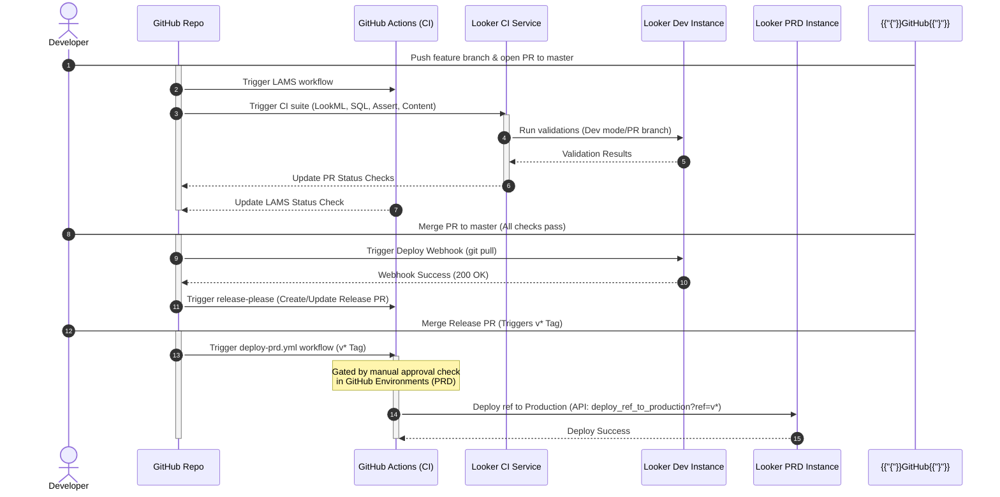

# Looker CI/CD Sample Project

This repository contains the LookML project for **looker_cicd_sample** along with a complete automated CI/CD pipeline integrated with **GitHub Actions**, **LAMS (LookAtMeSideways) Linter**, **Looker Continuous Integration (Looker CI)**, and **Release-Please**.

---

## CI/CD Workflow Overview

The entire CI/CD lifecycle is shown below:



### Detailed Pipeline Stages
1. **Pull Request Validation**: Pushing code to a feature branch and opening a PR triggers:
   - **LAMS**: GitHub Actions run the LookML linter to enforce code style.
   - **Looker CI**: Validates LookML syntax, tests database SQL for every modified explore/dimension/join, executes data tests (`test: ...`), and scans user content (dashboards, looks) in shared spaces to ensure nothing is broken.
2. **Post-Merge Development Deployment**: When a PR is merged into `master`:
   - A **GitHub Push Webhook** is automatically sent to the Looker Dev instance to pull the remote `master` commits and deploy them to the Dev instance's production mode.
   - Simultaneously, **Release-Please** creates or updates a Release PR targeting `master` containing versioning updates and a changelog generated from Conventional Commits.
3. **Production Deployment & Content Migration**: When the Release PR is merged:
   - A release tag (matching `v*`) is pushed.
   - The production deployment workflow (`deploy-prd.yml`) is triggered.
   - This workflow is gated by a **manual approval check** configured under the GitHub Environment named `PRD`.
   - Once approved, the workflow:
     - Deploys the tagged LookML ref to the Looker Production instance using Looker's Advanced Deploy Mode API (`deploy_ref_to_production`).
     - Backs up and migrates Looker Shared Folder content (`looker-deployer` / `gazer`) from Dev to Production via Google Cloud Storage (GCS).

---

## Local Development Instructions

Developers should use the Looker IDE to build and test their LookML models in personal Development Mode.

### Pre-commit Guidelines
Before committing or pushing any LookML changes:
1. **LookML Validator**: Run the Looker LookML Validator in the IDE to ensure no compilation/syntax errors.
2. **Data Tests**: Execute all Looker data tests (configured via `test: ...` blocks) directly in the Looker IDE to verify data constraints and metrics correctness.
3. **Conventional Commits**: Commit messages must follow the [Conventional Commits](https://www.conventionalcommits.org/en/v1.0.0/) specification.
   - Use `feat:` for new features (e.g., `feat: add new user conversion explore`).
   - Use `fix:` for bug fixes (e.g., `fix: correct join path in order_items`).
   - Use `chore:`, `docs:`, `refactor:`, `style:`, `test:`, or `ci:` for non-functional tasks.
   - *Why?* Release-Please relies on these prefixes to automatically increment the version (patch, minor, major) and build the release changelog.

---

## Looker Continuous Integration (Looker CI) Integration

We use Looker's native **Continuous Integration (Looker CI)** feature for automated PR validation.

### 1. Enabling Looker CI on the Dev Instance
As a Looker Admin:
1. Navigate to the **Admin** panel on your Dev instance.
2. Under the **Platform** section, select **Continuous Integration**.
3. Toggle the **Enable Continuous Integration** setting on.

### 2. Installing the Looker CI GitHub App
To trigger runs automatically when pull requests are created:
1. On the **Continuous Integration** Admin page, locate the **GitHub** table.
2. Find the entry for your repository `looker_cicd_sample` (which may be listed under your username or organization).
3. Click the **Configure GitHub App** blue button at the bottom of the section.
4. Follow the GitHub authorization flow:
   - Select the GitHub organization/account where the repository is located.
   - Choose **Only select repositories** and select `looker_cicd_sample` (or "All repositories" if preferred).
   - Click **Install & Authorize**.
5. Once redirected back to the Looker Admin panel, you should see a green checkmark indicating **Installed** next to the `looker_cicd_sample` repository in the list.

### 3. Configuring the CI Suite & Validators
In the Looker IDE on the Dev instance:
1. Click the **Continuous Integration** icon on the left navigation bar.
2. Click **Suites**, then click **Create suite**.
3. Set the **Suite name** to `Main-Test`.
4. Toggle on **Trigger on pull requests from Looker**.
5. Configure the following validators in the suite:
   - **LookML Validator**: Fails on Errors.
   - **SQL Validator**: Configure to run with `LIMIT 0` to validate SQL without fetching data.
   - **Assert Validator**: Discovers and runs all data tests defined via `test` blocks.
   - **Content Validator**: Configured to check shared spaces (excluding Personal and Archive folders) to catch broken dashboards or looks.

### 4. GitHub Branch Protection
Enforce status checks on the `master` branch:
1. Navigate to your GitHub repository settings > **Branches**.
2. Add or edit a branch protection rule for the `master` branch.
3. Check **Require status checks to pass before merging**.
4. Search for and require the following checks to pass (named after the `Main-Test` suite):
   - `Looker CI / Main-Test / LookML Validator`
   - `Looker CI / Main-Test / SQL Validator`
   - `Looker CI / Main-Test / Assert Validator`
   - `Looker CI / Main-Test / Content Validator`
5. Check **Require linear history** (to ensure clean rebase merges).

---

## LAMS Linting

**LAMS (LookAtMeSideways)** is a LookML linter that enforces styling and structural rules.

### Custom Rules Configuration
Rules are defined under `manifest.lkml`. For example, our custom description validator:
```lookml
# LAMS
# rule: dimensions_require_descriptions {
#   description: "All dimensions must have a description."
#   match: "$.file.*.view.*.dimension.*"
#   expr_rule: ( !== ::match:description undefined ) ;;
# }
```

### GitHub Actions Workflow (`lams.yml`)
The workflow operates on pull requests targeting `master`:
1. Checks out the code.
2. Sets up Node.js.
3. Installs the linter globally: `npm install -g @looker/look-at-me-sideways@3`.
4. Runs `lams --reporting=github` utilizing the automated `GITHUB_TOKEN` secret to report inline annotations on the PR.

---

## Release Automation

We use Google's **Release-Please** to manage versioning and release tags.

### Release-Please Workflow (`release.yml`)
- Triggered on push to the `master` branch.
- Uses `google-github-actions/release-please-action@v4` with `release-type: simple`.
- When a commit is merged to `master`, it analyzes commit history, creates or updates an open "Release PR" containing the updated version and changelog.
- When the Release PR is merged, it tags the commit (e.g. `v1.2.0`) and creates a GitHub Release.

---

## Gated Deployments

### Dev Deployment (Native Webhook)
- **Trigger**: Pushes/merges to the `master` branch.
- **Execution**: GitHub automatically triggers Looker's native push webhook, passing the webhook secret. Looker pulls the latest remote `master` commits and updates its production mode instantly.
  ```bash
  POST /webhooks/projects/looker_cicd_sample/deploy
  ```

### PRD Deployment (`deploy-prd.yml`)
- **Trigger**: Pushes of tags matching `v*` (usually when a Release PR is merged).
- **Environment Gating**: The job runs under the GitHub Environment named `PRD`.
  > [!NOTE]
  > **GitHub Free Tier Limitation**: For private repositories on GitHub Free, manual approval gates ("Required reviewers") are disabled. In this scenario, we recommend configuring **Deployment branches and tags** rules restricted to `v*` tags as a safety guard. For production/customer repositories, always configure **Required reviewers** to enforce a human-in-the-loop validation step.
- **Execution**: Upon approval (or when triggered by a matching tag release), the workflow performs the following actions:
  1. **LookML Deployment**: Logs in to the PRD Looker instance and calls the Advanced Deploy Mode API to deploy the specific tag ref:
     ```bash
     POST /api/4.0/projects/looker_cicd_sample/deploy_ref_to_production?ref=v*
     ```
  2. **GCS Backup**: Checks if a backup already exists for the deployment tag. If not, exports Looker Shared Folder (folder ID `1`) content from the Dev instance using `looker-deployer` / `gazer` and uploads it to Google Cloud Storage (GCS).
     - **GCS Backup Directory Structure**: `gs://looker-migrations-snapshots-gitops/looker_backups/<tag>/`
  3. **Shared Folder Content Import**: Downloads the backup from GCS and imports the content recursively into the PRD instance's Shared Folder using `looker-deployer`.

- **GCP Authentication Options**:
  The workflow supports two options for authenticating to GCP to access GCS:
  - **Service Account Key (Credential-based)**: Uses the JSON key for the deployment Service Account stored in the `GCP_SA_KEY` secret.
  - **Workload Identity Federation (Keyless)**: Authenticates using OpenID Connect (OIDC) via `GCP_WORKLOAD_IDENTITY_PROVIDER` and `GCP_SERVICE_ACCOUNT` variables.

---

## Required Environment Secrets and Variables

Configure the following GitHub Secrets/Variables under repository settings to allow GHA workflows to authenticate against Looker API and GCP:

| Name | Type | Description |
|---|---|---|
| `DEV_LOOKERSDK_BASE_URL` | Secret | Base API URL for Dev Looker instance (e.g. `https://<dev-url>:19999`) |
| `DEV_LOOKERSDK_CLIENT_ID` | Secret | API Client ID for the Dev instance deployer user |
| `DEV_LOOKERSDK_CLIENT_SECRET` | Secret | API Client Secret for the Dev instance deployer user |
| `PRD_LOOKERSDK_BASE_URL` | Secret | Base API URL for PRD Looker instance (e.g. `https://<prd-url>:19999`) |
| `PRD_LOOKERSDK_CLIENT_ID` | Secret | API Client ID for the PRD instance deployer user |
| `PRD_LOOKERSDK_CLIENT_SECRET` | Secret | API Client Secret for the PRD instance deployer user |
| `GCP_SA_KEY` | Secret | JSON key for the GCP Service Account (optional, required if using Service Account Key authentication) |
| `GCP_WORKLOAD_IDENTITY_PROVIDER` | Variable | Workload Identity Provider resource path (optional, required if using Workload Identity Federation) |
| `GCP_SERVICE_ACCOUNT` | Variable | GCP Service Account email (optional, required if using Workload Identity Federation) |

---

## Required Setup Settings

### 1. GitHub Actions Workflow Permissions
To allow **Release-Please** to automatically generate release Pull Requests and changelogs, you must enable write permissions on your repository:
1. In your GitHub repository, go to **Settings** (top tab bar).
2. Under the left sidebar, navigate to **Actions > General**.
3. Scroll down to the **Workflow permissions** section.
4. Select **Read and write permissions**.
5. Check the box for **"Allow GitHub Actions to create and approve pull requests"**.
6. Click **Save**.

### 2. Enable Advanced Deploy Mode (PRD Instance)
To allow deployment of specific Git tags to the Production instance via the `deploy_ref_to_production` API, you must enable Advanced Deploy Mode:
1. Open the project in the Looker IDE on your **PRD** instance.
2. Go to **Project Settings** (the gear icon on the left sidebar).
3. Under the **Git Integration** section, toggle on **Enable Advanced Deploy Mode**.
4. Click **Save**.

### 3. Configure Native Push Webhook (Dev Instance)
To automatically deploy pushes or PR merges to `master` into the Dev instance's Production mode securely:
1. **GitHub Repository Settings**:
   - In your repository on GitHub, navigate to **Settings > Webhooks > Add webhook**.
   - **Payload URL**: `https://<your-dev-looker-url>/webhooks/projects/looker_cicd_sample/deploy` (replace `<your-dev-looker-url>` with your Dev instance's domain).
   - **Content type**: `application/json`
   - **Secret**: Enter a secure random string (which will be used to sign and authenticate webhook calls).
   - Select **Just the push event**.
   - Click **Add webhook**.
2. **Looker Dev Instance Settings**:
   - Open the project in the Looker IDE on your **Dev** instance.
   - Go to **Project Settings** (gear icon on the left sidebar).
   - Paste the exact same secret string into the **Webhook Deploy Secret** field.
   - Click **Save Project Settings**.

---

## Rollback Procedure

In the event of an issue on the production Looker instance, you can easily perform a rollback to a previous version (both for the LookML code and its associated dashboard/look content).

### **How it works under the hood**
When you rollback to an older tag (e.g. `v1.0.0`):
1. **LookML Rollback**: The deployment workflow tells the PRD Looker instance's Advanced Deploy Mode API to target the specific older tag ref (`v1.0.0`).
2. **Content snapshot Rollback**: The GCS backup step detects that a backup folder for `v1.0.0` already exists on GCS. Rather than exporting the current (broken) folder from Dev, it skips the export and directly downloads the historical backup snapshot of `v1.0.0` and imports it into PRD.

### **Steps to Rollback**
1. Navigate to your repository on GitHub.
2. Go to the **Actions** tab.
3. In the left sidebar, click the **Deploy to PRD** workflow.
4. Click the **Run workflow** dropdown button on the right side of the page.
5. In the **Use workflow from** dropdown, select the target release tag you want to rollback to (e.g. `v1.0.0`).
6. Click the green **Run workflow** button.
7. Approve the deployment gate in the Actions UI (or let it execute if gates are bypassed).

The pipeline will safely restore both your LookML repository files and the shared folder dashboards/looks to the state they were in at that tag!
